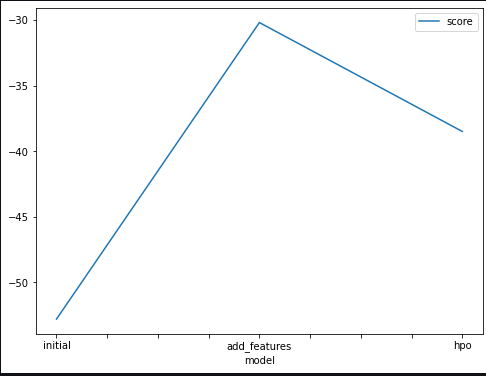
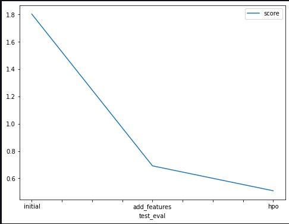

# Report: Predict Bike Sharing Demand with AutoGluon Solution
#### JOSHUA SALAKO

## Initial Training
### What did you realize when you tried to submit your predictions? What changes were needed to the output of the predictor to submit your results?
I noticed that there were some negative values. I had to replace all negative values with zero.

### What was the top ranked model that performed?
WeightedEnsemble_L3 performed best with a score of -52.808336

## Exploratory data analysis and feature creation
### What did the exploratory analysis find and how did you add additional features?
From the visualization, I discovered correlation between the target and other features. Knowing that, I decided to explore more on the data. I added features of 'month', 'day', and 'hour' from the 'datetime' column. Using the 'hour' column, I created a new column, 'rush_hour', which specifies whether it is a morning, afternoon , or evening time. From the 'temp' column, I created a new feature; 'cat_temp', which specifies, using a specific threshold, whether it is cold, hot, or mild. I also created 'cat_humid' and 'cat_windspeed' from the 'humidity' and 'windspeed' columns respectively which specifies whether the humidity is low or not and if it is windy or not. Finally, I did one-hot encoding for the 'rush_hour', 'cat_temp', 'cat_humid', and 'cat_windspeed' columns while I dropped them from the dataset.

### How much better did your model preform after adding additional features and why do you think that is?
My model performed very much better after adding more feature. My score rose from 1.6 to about 0.6 which is a very huge difference.

## Hyper parameter tuning
### How much better did your model preform after trying different hyper parameters?
My model improved a little after hyperparameter tuning, although the improvement is not as much as when I added new features but it is also significant. My score rose to about 0.5

### If you were given more time with this dataset, where do you think you would spend more time?
I would spend more time with preprocessing the data by doing more feature creation cnd also try out more model optimization through hyperparameter tuning.

### Create a table with the models you ran, the hyperparameters modified, and the kaggle score.
|model|hpo1|hpo2|hpo3|score|
|--|--|--|--|--|
|initial|eval_metric|time_limit|presets|1.80316|
|add_features|eval_metric|time_limit|presets|0.69186|
|hpo|NN learning rate|NN Number of epochs|GBM Number of leaves|0.50965|

### Create a line plot showing the top model score for the three (or more) training runs during the project.

TODO: Replace the image below with your own.

### Create a line plot showing the top kaggle score for the three (or more) prediction submissions during the project.

TODO: Replace the image below with your own.

## Summary
This is a very interesting project. I believe that with more EDA and hyperparameter tuning, I can tp the leaderboard of this competition.
